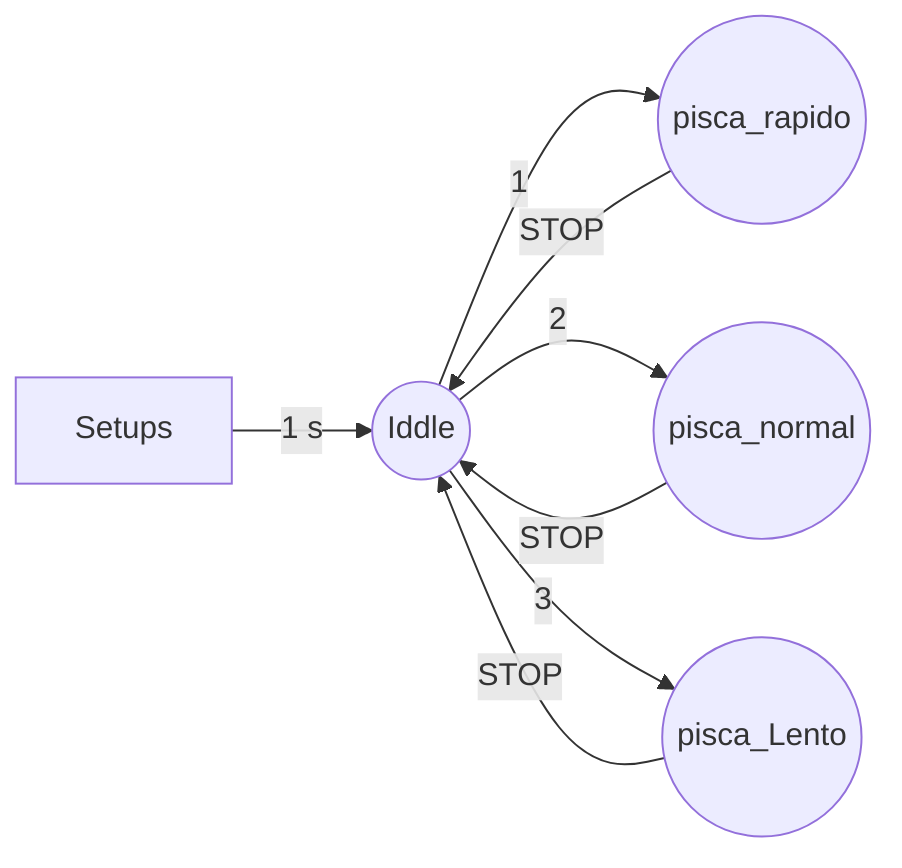
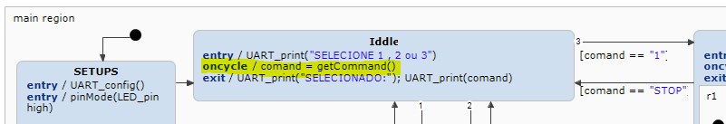

# Protótipo Blink controlado via UART

Este protótipo tem como objetivo replicar algumas características que serão necessárias no projeto principal.

---
## Características desenvolvidas

- Comandos GPIO (LED blink);
	- digitalWrite(pin: integer, value: integer)
	- operation pinMode(pin: integer, mode: integer)
- Comunicação UART;
	- operation UART_config()
	- operation UART_print(mensagem: string)
	- operation UART_read() : string
- Temporização de ações;
	- sc_timer_service.cpp (Gerado utilizando ITEMIS)
	- sc_timer_service.h
- Geração de código ITEMIS (C++).
- Interface grafica de comando UART via rasp.

## Projeto prototipo
 

 

 ## Adaptação de prototipo para freeRTOS

 1. Migrar de loop para task de controle de maquina de estados;
		[ executado em Pisca_LED_5_freeRTOS ]: resumo de alteração:

```C++
void loop() {
    /*timerService.processTimers();
    //statechart.runCycle();
    statechart.triggerWithoutEvent();
    delay(10);*/
    unsigned long now = millis();
    unsigned long elapsed = now - lastCycleTime;

    if (elapsed >= 10) { // Tempo mínimo entre ciclos (ajuste conforme necessário)
        lastCycleTime = now;

        timerService.proceed(elapsed);        // Atualiza os timers
        statechart.triggerWithoutEvent();
    }
}
```
PARA

```C++
// Task que substitui o loop()
void statechartTask(void *pvParameters) {
    TickType_t lastWakeTime = xTaskGetTickCount();

    while (true) {
        timerService.proceed(10);  // Atualiza timers
        statechart.triggerWithoutEvent();  // Ciclo da máquina de estados
        vTaskDelayUntil(&lastWakeTime, pdMS_TO_TICKS(10)); // Delay fixo
    }
}

// em SETUP()
// Criação da task do FreeRTOS
    xTaskCreate(
        statechartTask,     // Função
        "StatechartTask",   // Nome
        4096,               // Stack size (ajuste se necessário)
        NULL,               // Parametros
        1,                  // Prioridade
        NULL                // Handle
    );
}
```
 2. Migrar interação via UART para task freeRTOS;
		[ Pisca_LED_6_freeRTOS_UART-CMD]: resumo de alteração:
		
Criado uma task geral reponsavel por verificar a entrada de dados UART:
```C++
void uartListenerTask(void *pvParameters) {
    while (true) {
        sc_string cmd = callbackControl.UART_read();
        String strCmd = String(cmd);

        if (strCmd.length() > 0) {
            if (xSemaphoreTake(commandMutex, pdMS_TO_TICKS(50))) {
                receivedCommand = strCmd;
                xSemaphoreGive(commandMutex);
            }
        }

        free(cmd); // Libera memória do strdup
        vTaskDelay(pdMS_TO_TICKS(300)); //REVISAR TEMPO, POSSIVELMENTE PODE SER ATÉ 500
    }
}
```
Criado processo de consulta se a task recebeu ou não um dado:
 
```C++
sc_string CallbackController::getCommand() {
    if (xSemaphoreTake(commandMutex, pdMS_TO_TICKS(50))) {
        String cmd = receivedCommand;
        receivedCommand = ""; // Limpa após ler
        xSemaphoreGive(commandMutex);
        return strdup(cmd.c_str());
    }
    return strdup("");
}
```

