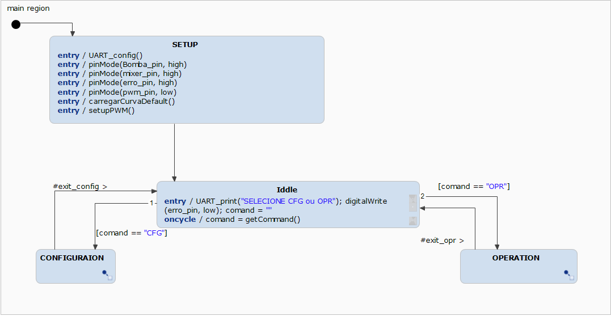
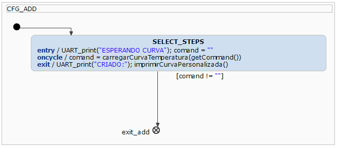
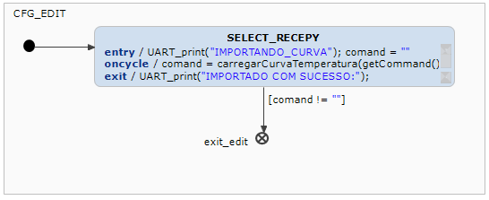
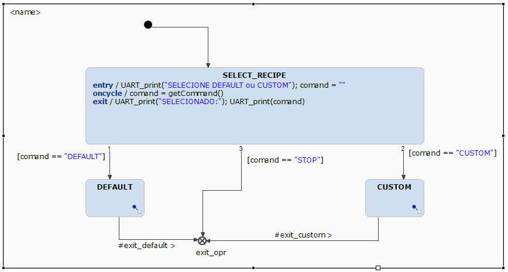
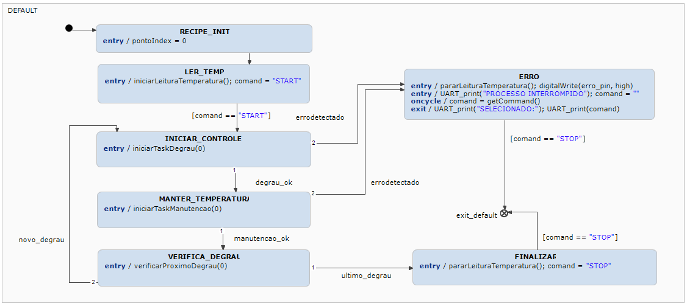
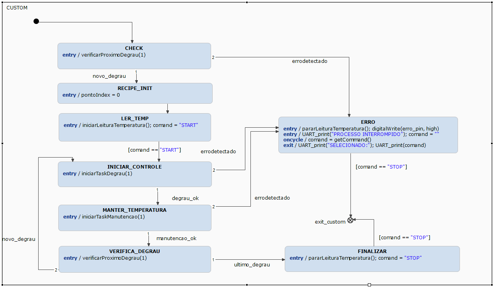

# Sistemas Embarcados - 2025.1

Este projeto consiste no desenvolvimento de um sistema embarcado completo para o **controle automático de curvas de temperatura**, voltado ao processo artesanal de produção de cerveja.

O sistema permite:
- Configurar curvas de temperatura com múltiplos estágios;
- Monitorar e controlar o aquecimento com precisão via **controle PID**;
- Visualizar o processo em tempo real através de uma **interface gráfica interativa**;
- Operar com sensores simulados ou reais, ideal para testes e prototipagem com **ESP32** e **Raspberry Pi**.

---

## Demonstração do Protótipo Final

> Clique na imagem abaixo para assistir à demonstração do sistema físico em operação, executando a simulação do controle de temperatura conforme a curva padrão:

[](https://www.youtube.com/embed/pO3XyxYa414)


---

## Índice

- [Requisitos Minimos](#requisitos-m%C3%ADnimos)
- [Funcionalidades](#funcionalidades)
- [Instalação](#instalação)
- [Demonstração](#demonstração)
- [Considerações Finais](#considerações-finais)

## Requisitos mínimos

- Interfaces: 
	- Interface i2C [não alcançado];
	- Interface GPIO [implementado];
	- Interface PWM [implementado];
	- interface UART [implementado];
- Funcionais: 
	- Curva padrão: o sistema deve possuir uma carva padrão pré-configurada composta por 3 etapas de aquecimento T0 67°C, T1 78°C e T3 temperatura max (fervura);
	- Interface de comando: o sistema deve possuir interface de comando via computador;
	- Tratativa de erros: o sistema deve possuir métricas que permitam identificar, sinalizar e atuar em casos de erros no sistema;
	- Controle de temperatura: o sistema deve regular a temperatura através de um controle PID ou controle simples por histerese;

- Organizacionais:
	- Documentação de Hardware: deve possuir documentação que descreva o hardware implementado;
	- Statecharts: o sistema deve ser implementado utilizando a statecharts para descrever o seu funcionamento;
	- Github: deve possui documentação compartilhada em repositório github;

Anotações/Sugestões discutidas em sala:
- Doxygen, aplicação permite gerar um documentação automatizada dos códigos gerados durante o projeto;  

## Requisitos Adicionais

- Interfaces de comandos Raspbery: 
	- Interface gráfica [implementado];
	- interface de comandos via UART [implementado];
	- Leitor de PWM;
	- Simulador de sensor de temperatura i2C [não alcançado];
			- Migrado para resposta UART [implementado];
	- Aplicar resposta da leitura PWM na temperatura simulada [implementado]
- Configuração de curvas adicionais personalizadas[implementado];

## Etapa 1 - Implementação de fluxograma Itemis

Durante esta etapa foi desenvolvido a estrutura inicial que determina o funcionamento do sistema, esta foi implementada através de um statechart criado utilizando o software Itemis.
O primeiro bloco implementado foi o fluxo de inicialização e de seleção de operação;
#

> As funções mostradas na imagem foram sendo adicionadas ao longo da execução projeto e serão detalhadas mais a diante. 
#
A imagem acima mostra o fluxo de operação imaginado para o projeto:
- Setup: Inicia as variáveis e serviços necessários para que o sistema opere corretamente;
- Idle: Aguarda o usuário interagir com o sistema;
- Configuration: aciona as funções que permitirão ao usuário adicionar ou editar curvas de temperatura ao sistema;
- Operation: permite ao usuário iniciar a execução das curvas configuradas;
#

#
O bloco de configuração foi dividido de forma a permitir o usuário:
- Add: Adicionar uma nova curva customizada ao sistema;
- Edit: Inicialmente pensado em para permitir ao usuário editar curvas salvas, posteriormente alterado para permitir que o usuário seleciona qual curva customizada será enviada para o sistema, esta alteração ocorreu devido a mudança de local de armazenamento das curvas(inicialmente ESP, posteriormente rasp junto a aplicação de controle);
Devido a estratégia de operação via interface gráfica, os estados ADD e EDIT ficaram semelhantes e representam apenas um ponto de espera onde o ESP aguarda os dados tratados pela interface com usuário;
#


#
O bloco de operação foi dividido de forma que o usuário possa escolher executar a curva pré estabelecida no sistema ou executar uma das curvas criadas posteriormente.
#

#
Ao executar a curva pré configurada o processo ocorre conforme a seguir:
- Inicializa uma variável para navegar na curva default;
- Inicializa a leitura dos sensores de temperatura i2C, alterado posteriormente para UART;
- Inicia a etapa de controle/aquecimento, para chegar a temperatura desejada;
- Inicia a etapa para manter a temperatura pelo tempo determinado após alcançar a temperatura desejada
- Verificar se existe uma nova temperatura:
	- Caso exista, reinicia o processo com o novo alvo;
	- Caso não exista, encerra o processo e retorna ao menu principal;
- Tambem foi adicionado um estado de erro, que em caso de problemas pode ser acionada por todas as etapas principais;
 #

#
Ao executar curvas customizadas, o processo foi desenhado de forma muito semelhante, com apenas um passo a mais, uma verificação se a curva personalizada possui pelo menos um degrau.
 #

#
Para que este fluxo funcione corretamente foram necessárias estabelecer algumas variáveis, eventos e operações:

|Variáveis|objetivo|
|----------------|-------------------------------|
|const low : integer = 0	| utilizada para padronizar o parse de dados para o arduino IDE|
|const high : integer = 1	|utilizada para padronizar o parse de dados para o arduino IDE|
|const Bomba_pin : integer = 2	|utilizada para o GPIO da Bomba|
|const mixer_pin : integer = 4	|utilizada para o GPIO do mixer|
|const pwm_pin : integer = 18	|utilizada para o GPIO do PWM|
|const erro_pin : integer = 16	|utilizada para o GPIO de alerta de erro|
|var pontoIndex: integer = 0	|utilizado para navegar no struct de degraus|
|var comand : string		|utilizado durante o parse de comandos UART|
|var temp : string		|utilizado como variavél de transição|
#
|Eventos|objetivo|
|----------------|-------------------------------|
|in event degrau_ok	|sinaliza a termino do aquecimento|
|in event manutencao_ok	|sinaliza a termino da temporização|
|in event novo_degrau	|sinaliza que o struct possui outro degrau|
|in event ultimo_degrau	|sinaliza a termino do processo|
|in event errodetectado	|sinaliza erros em geral|
#
|Operações|objetivo|
|----------------|-------------------------------|
|operation digitalWrite(pin: integer, value: integer)              | controla um GPIO (padrão arduito IDE)|
|operation pinMode(pin: integer, mode: integer)                    | controla um GPIO (padrão arduito IDE)|
|operation UART_config()                                           | executa o setup da UART|
|operation UART_print(mensagem: string)                            | executa uma escrita UART|
|operation UART_read() : string                                    | executa uma leitura UART|
|operation getCommand() : string                                   | coleta a ultima leitura da UART |
|operation carregarCurvaDefault()                                  | carrega a curva padrão durante inicialização|
|operation carregarCurvaTemperatura(mensagem: string) : string     | carrega a nova curva personalizada para o sistema|
|operation imprimirCurvaPersonalizada()                            | imprima a curva carregada, utilizada para debug|
|operation iniciarLeituraTemperatura()                             | inicia a task de leitura de sensores|
|operation pararLeituraTemperatura()                               | finaliza a task de leitura de sensores|
|operation setupPWM()                                              | executa o setup do PWM durante a inicialização|
|operation iniciarTaskDegrau(curvaId: integer)                     | inicia a task de aquecimento, utiliza a temperatura lida para realizar o controle PID|
|operation iniciarTaskManutencao(curvaId: integer)                 | inicia a task de manutenção da temperatura, mantem o controle PID e realiza o controle de tempo|
|operation encerrarTaskDegrau()                                    | encerra task de aquecimento(substituída por finalização orientada a evento dentro da task)|
|operation encerrarTaskManutencao()                                | encerra task de manutenção(substituída por finalização orientada a evento dentro da task)|
|operation verificarProximoDegrau(curvaId: integer)                | verifica a existência de um próximo degrau|
#
Estas operações foram posteriormente implementadas nos código **CallbackController.cpp** e **CallbackController.H**

## Etapa 2 - Implementação de callbacks em C++

Das operações criadas para este projeto, algumas utilizaram os exemplos básicos da arquitetura Arduino IDE, portando não entrarei em detalhes nesta descrição. Todas funções utilizadas no projeto estarão disponíveis através do link [Projeto_final_ESP](https://github.com/AlexVieira290/Sistemas-Embarcados-2025.1/tree/main/Projeto_final_ESP "Projeto_final_ESP"), nos arquivos **CallbackController.cpp** e **CallbackController.H**.

A seguir vou descrever as principais funções criadas para o projeto:


 1. carregarCurvaDefault: Esta função é utilizada para durante a inicialização criar a curva padrão, requisito do projeto. Esta armazena os valores em um struct conforme descrito abaixo:
---
<details>
  <summary>Ver códigos: </span></summary>

```C++
//======= struct para curvas
struct CurvaPonto {
  float temperatura;
  String tempo;
};

struct Curva {
  std::vector<CurvaPonto> pontos;
};
//=================================

void CallbackController::carregarCurvaDefault() {
    curvaDefault.pontos.clear();
    curvaDefault.pontos.push_back({67.0, "01:00"});     //valor acordado como default 67, tempo selecionado apenas para facilitar simulação
    curvaDefault.pontos.push_back({72.0, "03:00"});     //valor acordado como default 78, tempo selecionado apenas para facilitar simulação
    curvaDefault.pontos.push_back({77.0, "03:00"});    //valor acordado como default 100, tempo selecionado apenas para facilitar simulação
    Serial.println("Curva default carregada via código.");
}
```
</details>

---

 2. carregarCurva e carregarCurvaTemperatura: São utilizadas para receber, verificar e carregar os valores recebidos via JSON para a curva personalizada,**carregarCurvaTemperatura** verifica se a mensagem recebida via UART possui os parâmetros do JSON necessarios, em caso de erro loga e descarta a mensagem recebida. Em caso de sucesso, chama a função **carregarCurva**, esta efetivamente le o JSON e aloca os valores no struct destinado a curva destino.
---
<details>
  <summary>Ver códigos: </span></summary>

```C++
sc_string CallbackController::carregarCurvaTemperatura(sc_string comando) {
    String jsonStr(comando);
    // verifica se inicia e termina com "{ }"
    if (!jsonStr.startsWith("{") || !jsonStr.endsWith("}")) {
        return "";
    }
    
    StaticJsonDocument<2048> doc;
    DeserializationError error = deserializeJson(doc, jsonStr);
    if (error) {
        Serial.print("Erro ao fazer parse do JSON: ");
        Serial.println(error.c_str());
        return "";
    }
    // verifica se possui o identificador "curva_temperatura"
    if (!doc.containsKey("curva_temperatura") || !doc["curva_temperatura"].is<JsonArray>()) {
        Serial.println("JSON inválido: chave 'curva_temperatura' ausente ou não é array.");
        return "";
    }
    // verifica se possui os campos "temperatura" e "tempo"
    JsonArray curvaArray = doc["curva_temperatura"];
    for (JsonObject ponto : curvaArray) {
        if (!ponto.containsKey("temperatura") || !ponto.containsKey("tempo")) {
            Serial.println("JSON inválido: um ou mais pontos estão incompletos.");
            return "";
        }
    }
    // executando a carga para o struct de curva personalizada
    carregarCurva(jsonStr, curvaPersonalizada);
    return "criado";
}

void carregarCurva(const String& jsonStr, Curva& curvaDestino) {
    StaticJsonDocument<2048> doc;
    // carrega a string recebida
    DeserializationError error = deserializeJson(doc, jsonStr);
    if (error) {
        Serial.print(F("Erro ao fazer parse do JSON: "));
        Serial.println(error.c_str());
        return;
    }
    //Alocação na struct
    std::vector<CurvaPonto>().swap(curvaDestino.pontos);
    JsonArray array = doc["curva_temperatura"];
    for (JsonObject ponto : array) {
        CurvaPonto novoPonto;
        novoPonto.temperatura = ponto["temperatura"];
        novoPonto.tempo = ponto["tempo"].as<String>();
        curvaDestino.pontos.push_back(novoPonto);
    }
    Serial.println(F("Curva carregada com sucesso."));
}
```
</details>

---
 3. **temperaturaTask** e **readTemperatureFromSensor**: São utilizadas para realizar as leituras de temperatura, devido a dificultadas enfrentadas na implementação do i2C slave(simulador de sensores de temperatura) estas estão simulando a leitura via UART. 
 **temperaturaTask**: implementa especificamente uma task periódica que realiza um medição dos sensores, após realizar a aquisição dos valores, calcula a media dos últimos 5 valores de cada sensor, e verifica se a diferença entre a media do sensor 1 e 2 é maior que 2 graus. A media de 5 valores foi adotada para evitar que variações bruscas de temperatura possam afetar a operação do sistema, a verificação da diferença é utilizada para verificar a necessidade de acionar a bomba e o mixer, realizar a equalização da temperatura da panela.
 **readTemperatureFromSensor**: implementa expecificamente a leitura de sensores, esta função que precisaria ser alterada para migrar o projeto para i2c, neste momento ela esta requisitando o valor de temperatura via UART enviando a string "TEMPERATURA1\n" ou "TEMPERATURA2\n", identificando para o rasp que deve responder a temperatura simulada para o sensor requisitado.
---
<details>
  <summary>Ver códigos: </span></summary>

```C++
float CallbackController::readTemperatureFromSensor(int sensorId) {
    const char* cmd = (sensorId == 1) ? "TEMPERATURA1\n" : "TEMPERATURA2\n";
    Serial.println(cmd);
    unsigned long start = millis();

    while (millis() - start < 1000) {
        sc_string resposta = UART_read();
        if (resposta && strlen(resposta) > 0) {
            return atof(resposta);
        }
        delay(10);
    }
    Serial.println("Timeout na leitura do sensor!");
    return NAN;
}

float CallbackController::calcMedia(float* vetor) {
    float soma = 0;
    for (int i = 0; i < VEC_SIZE; i++) {
        soma += vetor[i];
    }
    return soma / VEC_SIZE;
}

void CallbackController::temperaturaTask(void* pvParameters) {
    CallbackController* self = static_cast<CallbackController*>(pvParameters);
    Statechart* sm = self->getStateMachine(); // Get state machine pointer

    while (true) {
        float t1 = self->readTemperatureFromSensor(1);
        delay(100);
        float t2 = self->readTemperatureFromSensor(2);
        if (t1 > 0.1 && t2 > 0.1) {  // Considera válidas apenas temperaturas acima de 0.1 °C
            temp1[index] = t1;
            temp2[index] = t2;
            index = (index + 1) % VEC_SIZE;
            self->contaerros = 0; // resetando contador de erros
        } else {
            Serial.println("Leituras descartadas por erro de comunicação.");
            self->contaerros++; // Increment counter
            if (self->contaerros >= 10) {
                Serial.println("10 leituras descartadas consecutivamente!");
                if (sm) {
                    sm->raiseErrodetectado(); // Raise the event
                }
                self->contaerros = 0; // Reset counter after raising event
            }
        }

        float media1 = self->calcMedia(temp1);
        float media2 = self->calcMedia(temp2);
        float diff = fabs(media1 - media2);

        //Serial.printf("Média T1: %.2f°C | T2: %.2f°C | Diferença: %.2f°C\n", media1, media2, diff);

        if (diff > 2.0) {
            self->digitalWrite(PINO_BOMBA, LOW);   // Liga bomba
            self->digitalWrite(PINO_MIXER, LOW);   // Liga mixer
        } else {
            self->digitalWrite(PINO_BOMBA, HIGH);    // Desliga bomba
            self->digitalWrite(PINO_MIXER, HIGH);    // Desliga mixer
        }

        vTaskDelay(pdMS_TO_TICKS(TEMP_TASK_DELAY_MS));
    }
}
```
</details>

---

 4. **taskDegrauPID**: task periódica responsável por implementar o controle PID, controlando o PWM para realizar o aquecimento até a temperatura desejada. Implementada utilizando a biblioteca PID_v1, também implementa uma verificação para o caso do aquecimento estar ativo e a temperatura não subir. Caso esta situação se mantenha por 24 ciclos( aproximadamente 2 minutos ) é acionando uma flag de erro e o processo é interrompido.
---
<details>
  <summary>Ver códigos: </span></summary>

```C++
void CallbackController::taskDegrauPID(void* pvParameters) {
    TaskParamsID* params = static_cast<TaskParamsID*>(pvParameters);
    CallbackController* self = params->controller;
    int curvaId = params->curvaId;

    Curva* curva = (curvaId == 1) ? &curvaPersonalizada : &curvaDefault;
    setpoint = curva->pontos[pontoIndex].temperatura;
    
    delete params;
    // Reset do PID
    pid.SetMode(MANUAL);
    pid.SetOutputLimits(0, 255);
    output = 0;

    pid.SetMode(AUTOMATIC);
    pid.SetOutputLimits(0, 255);

    Statechart* sm = self->getStateMachine();
    Serial.printf("Aquecimento iniciado - Target: %.2f °C\n", setpoint);

    self->ultimatemperatura = (self->calcMedia(temp1) + self->calcMedia(temp2)) / 2.0; // Initialize with current temp
    self->contaerrosdegrau = 0;

    while (true) {
        // Atualiza a variável de entrada com a média dos sensores
        input = (self->calcMedia(temp1) + self->calcMedia(temp2)) / 2.0;
        Serial.printf("Valor atual: %.2f °C\n", input); // apenas para DEBUG

        pid.Compute();  // Calcula o novo valor de saída

        ledcWrite(PINO_PWM_AQUECEDOR, (int)output);  // Aplica o valor PWM

        // Verificar erro de aquecimento
        if (output > (0.01 * 255) && input < self->ultimatemperatura) {
            self->contaerrosdegrau++;
            if (self->contaerrosdegrau >= 24) { // verificar 2 minutos
                Serial.println("Erro: Possivel erro na resistencia.");
                if (sm) sm->raiseErrodetectado();
                self->contaerrosdegrau = 0; // Resetando o contador
                self->taskDegrauHandle = nullptr;
                vTaskDelete(NULL);
            }
        } else {
            self->contaerrosdegrau = 0; // Resetando o contador
        }
        
        self->ultimatemperatura = input; // atualizando o buffer

        if (fabs(setpoint - input) < 0.5) {
            Serial.println("Setpoint alcançado.");
            if (sm) sm->raiseDegrau_ok();
            self->taskDegrauHandle = nullptr;
            vTaskDelete(NULL);
        }

        vTaskDelay(pdMS_TO_TICKS(TEMP_TASK_DELAY_MS)); // intervalo padronizado com a leitura
    }
}
```
</details>

---
 5. **taskManutencao**: inicialmente era parte da task anterior, porem para descartar os erros acumulados no controle PID e facilitar o inicio da contagem de tempo foi separada em sua própria task com objetivo de manter a temperatura durante o tempo estabelecido.
Possui o mesmo controle para o caso de erro com o aquecedor descrito anteriormente.
---
<details>
  <summary>Ver códigos: </span></summary>

```C++
void CallbackController::taskManutencao(void* pvParameters) {
    TaskParamsID* params = static_cast<TaskParamsID*>(pvParameters);
    CallbackController* self = params->controller;
    int curvaId = params->curvaId;

    Curva* curva = (curvaId == 1) ? &curvaPersonalizada : &curvaDefault;
    setpoint = curva->pontos[pontoIndex].temperatura;
    String tempoStr = curva->pontos[pontoIndex].tempo;
    int tempoMs = tempoParaSegundos(tempoStr) * 1000;

    delete params;

    Statechart* sm = self->getStateMachine();

    // Reset do PID
    pid.SetMode(MANUAL);
    pid.SetOutputLimits(0, 255);
    output = 0;

    pid.SetMode(AUTOMATIC);
    pid.SetOutputLimits(0, 255);

    unsigned long inicio = millis();
    int printCounter = 0;

    self->ultimatemperatura = (self->calcMedia(temp1) + self->calcMedia(temp2)) / 2.0; // Initialize with current temp
    self->contaerrosdegrau = 0;

    while (true) {
        input = (self->calcMedia(temp1) + self->calcMedia(temp2)) / 2.0;
        Serial.printf("Valor atual: %.2f °C\n", input); // apenas para DEBUG
        pid.Compute();
        ledcWrite(PINO_PWM_AQUECEDOR, (int)output);

        // Verificar erro de aquecimento
        if (output > (0.01 * 255) && input < self->ultimatemperatura) {
            self->contaerrosdegrau++;
            if (self->contaerrosdegrau >= 24) { // verificar 2 minutos
                Serial.println("Erro: Possivel erro na resistencia.");
                if (sm) sm->raiseErrodetectado();
                self->contaerrosdegrau = 0; // Resetando o contador
                self->taskManutencaoHandle = nullptr;
                vTaskDelete(NULL);
            }
        } else {
            self->contaerrosdegrau = 0; // Resetando o contador
        }
        
        self->ultimatemperatura = input; // atualizando o buffer

        // Tempo decorrido e total
        unsigned long agora = millis();
        int decorrido = (agora - inicio) / 1000;
        int total = tempoMs / 1000;

        // Exibe tempo a cada ciclo
        if (printCounter++ % 4 == 0) {
            Serial.printf("Tempo: %ds de %ds (%.1f%%)\n", decorrido, total, (decorrido * 100.0) / total);
        }

        if (agora - inicio >= tempoMs) {
            Serial.println("Tempo de manutenção encerrado.");
            if (sm) sm->raiseManutencao_ok();
            self->taskManutencaoHandle = nullptr;
            vTaskDelete(NULL); // Encerra a task
        }

        vTaskDelay(pdMS_TO_TICKS(TEMP_TASK_DELAY_MS)); // intervalo padronizado com a leitura
    }
}
```
</details>

---
 6. **Controle de tasks freeRTOS**: Para todas as tasks mencionadas acima foram criadas as suas respectivas chamadas para inicialização e finalização das tasks no freeRTOS.
---
<details>
  <summary>Ver códigos: </span></summary>

```C++
// ======= CHAMADA PARA INICIAR AS TASKS DIRETAMENTE DO CALLBACK =======
void CallbackController::iniciarLeituraTemperatura() {
    if (tempTaskHandle == nullptr) {
        index = 0;
        xTaskCreatePinnedToCore(
            temperaturaTask,
            "TempTask",
            4096,
            this,
            1,
            &tempTaskHandle,
            APP_CPU_NUM
        );
        Serial.println("Task de temperatura iniciada");
    }
}

void CallbackController::iniciarTaskDegrau(sc_integer curvaId) {
    if (taskDegrauHandle == nullptr) {
        TaskParamsID* params = new TaskParamsID{this, curvaId};
        xTaskCreatePinnedToCore(
            CallbackController::taskDegrauPID,
            "TaskDegrauPID",
            4096,
            params,
            1,
            &taskDegrauHandle,
            APP_CPU_NUM
        );
    }
}

void CallbackController::iniciarTaskManutencao(sc_integer curvaId) {
    if (taskManutencaoHandle == nullptr) {
        TaskParamsID* params = new TaskParamsID{this, curvaId};
        xTaskCreatePinnedToCore(
            CallbackController::taskManutencao,
            "TaskManutencao",
            4096,
            params,
            1,
            &taskManutencaoHandle,
            APP_CPU_NUM
        );
    }
}

// ======= FUNÇÕES PARA ENCERRAR TASKS EM CASO DE PROBLEMAS =======
void CallbackController::encerrarTaskDegrau() {
    if (taskDegrauHandle != nullptr) {
        vTaskDelete(taskDegrauHandle);
        taskDegrauHandle = nullptr;
        Serial.println("Task Degrau encerrada.");
    }
}

void CallbackController::encerrarTaskManutencao() {
    if (taskManutencaoHandle != nullptr) {
        vTaskDelete(taskManutencaoHandle);
        taskManutencaoHandle = nullptr;
        Serial.println("Task Manutenção encerrada.");
    }
}

void CallbackController::pararLeituraTemperatura() {
    if (tempTaskHandle != nullptr) {
        vTaskDelete(tempTaskHandle);
        tempTaskHandle = nullptr;
        Serial.println("Task de temperatura encerrada");
    }
}
```
</details>

---

## Etapa 3 - Implementação do App de controle python

Para realizar o controle do projeto via rasberry foi implementado app com interface gráfica utilizando **tkinter** [Projeto_final_ESP](https://github.com/AlexVieira290/Sistemas-Embarcados-2025.1/tree/main/Projeto_final_ESP "Projeto_final_ESP"), este aplicativo consiste em, **Interface de controle para o usuário**,**Feedback visual da operação**, **Simulador de sensores de temperatura** e um **Leitor de PWM**(utilizado pelo simulador de sensores).

 1. **PwmReader**: Responsável por realizar a leitura do sinal PWM gerado pelo ESP32. A leitura é feita utilizando um dos pinos do Raspberry Pi e permite calcular o duty cycle aplicado no aquecimento. A classe monitora continuamente o sinal e disponibiliza esse valor, representando o percentual de tempo em que o sinal permanece em nível alto. Essa leitura é essencial para simular uma reação ao PWM imposto pelo controle PID no ESP32.
---
<details>
  <summary>Ver código de PwmReader</span></summary>

```python
class PwmReader:
    def __init__(self, gpio_pin):
        self.pi = pigpio.pi()
        self.gpio_pin = gpio_pin
        self.high_time = 0
        self.low_time = 0
        self.last_tick = 0
        self.level = 0
        self.duty_cycle = 0
        self.last_update = time.time()

        self.cb = self.pi.callback(self.gpio_pin, pigpio.EITHER_EDGE, self._cb)

    def _cb(self, gpio, level, tick):
        if self.last_tick == 0:
            self.last_tick = tick
            self.level = level
            return

        dt = pigpio.tickDiff(self.last_tick, tick)
        self.last_tick = tick

        if self.level == 1:
            self.high_time = dt
        else:
            self.low_time = dt

        self.level = level

        total = self.high_time + self.low_time
        if total > 0:
            self.duty_cycle = (self.high_time / total) * 100
            self.last_update = time.time()

    def get_duty_cycle(self):
        # timeout de 1 segundo para sinal perdido
        if time.time() - self.last_update > 1:
            if self.pi.read(self.gpio_pin) == 1:
                return 100.0  # PWM travado em nível alto
            else:
                return 0.0  # PWM travado em nível baixo (0%)
        return round(self.duty_cycle, 2)

    def stop(self):
        self.cb.cancel()
        self.pi.stop()
```
</details>

---

 2. **SimuladorTemperatura**: criada para simular sensores de temperatura, esta simulação é utilizada nos testes quando não se possui acesso aos sensores I2C. Esta classe roda em uma thread separada, evitando travamentos na interface principal e permitindo que a simulação ocorra em paralelo com a execução da aplicação. Os valores simulados variam ao longo do tempo em função do duty cycle aplicado, da diferença entre os sensores e do estado dos atuadores (bomba e misturador).

A lógica implementada:

- Quando bomba e misturador estão ativos, o sensor do fundo da panela (temp_ambiente) é aquecido mais intensamente que o sensor superior (temp_cpu), simulando um aquecimento com convecção forçada parcial;
- Quando ambos estão desligados, o sistema força a equalização das temperaturas, simulando a condução térmica natural;
- Quando apenas um dos atuadores está ativo, ambos os sensores aumentam a temperatura de forma mais lenta e equilibrada.

Em todos os casos, o duty cycle influencia diretamente na variação, quanto maior o duty, maior o delta aplicado. 
Em situações de resfriamento (duty = 0), a temperatura decresce gradualmente até um valor mínimo estabelecido (20 °C), simulando a perda térmica natural.

Essa abordagem foi adotada para facilitar a visualização da atuação do controle PID e das condições de operação do sistema.

---
<details>
  <summary>Ver código de SimuladorTemperatura</span></summary>

```python
class SimuladorTemperatura(threading.Thread):
    def __init__(self, pwm_reader):
        super().__init__(daemon=True)
        self.executando = True
        self.pwm_reader = pwm_reader
        self.temp_ambiente = 64
        self.temp_cpu = 64

    def parar(self):
        self.executando = False
        self.pwm_reader.stop()

    def run(self):
        while self.executando:
            duty = self.pwm_reader.get_duty_cycle()
            pwm_ativo = duty > 0

            bomba_on = bomba.is_active
            misturador_on = misturador.is_active

            if pwm_ativo:
                diff = self.temp_ambiente - self.temp_cpu
                if bomba_on and misturador_on:
                    # Cria diferença artificial: temp1 aumenta mais que temp2
                    delta1 = (duty / 100) * 1.2
                    delta2 = ((duty / 100) * 0.4) + diff * 0.05
                elif not bomba_on and not misturador_on:
                    # Convergência: reduz diferença entre temp1 e temp2
                    ajuste = (duty / 100) * 0.6

                    if diff > 0:
                        delta1 = -ajuste
                        delta2 = ajuste
                    elif diff < 0:
                        delta1 = ajuste
                        delta2 = -ajuste
                    else:
                        delta1 = delta2 = (duty / 100) * 0.5
                else:
                    # Caso intermediário: sobe normalmente
                    delta1 = delta2 = (duty / 100) * 0.6
            else:
                # PWM = 0 → Esfriamento padrão
                ambient_floor = 20.0  # mínimo realista
                delta1 = -0.2 if self.temp_ambiente > ambient_floor else 0
                if self.temp_cpu > self.temp_ambiente:
                    delta2 = -0.2
                else:
                    delta2 = -0.05

            self.temp_ambiente = max(0, min(100, self.temp_ambiente + delta1 * 0.1))
            self.temp_cpu = max(0, min(100, self.temp_cpu + delta2 * 0.1))

            global temperatura_simulada_1, temperatura_simulada_2
            temperatura_simulada_1 = self.temp_ambiente
            temperatura_simulada_2 = self.temp_cpu

            root.after(0, lambda: pwm_progressbar.config(value=duty))
            root.after(0, lambda: pwm_percentage_label.config(text=f"{duty:.1f}%"))

            root.after(0, lambda: label_temp_ambiente.config(text=f"Sensor Panela - Fundo: {self.temp_ambiente:.1f} °C"))
            root.after(0, lambda: label_temp_cpu.config(text=f"Sensor Panela - Superior: {self.temp_cpu:.1f} °C"))

            time.sleep(1)
```
</details>

---
 3. **toggle_simulador**: responsável por ativar ou desativar a simulação de temperatura. Caso a implementação do simulador I2C tivesse ocorrido com sucesso, seria possivel ativar e desativar a simulação para momentos em que se tem acesso aos sensores.
---
<details>
  <summary>Ver código de toggle_simulador</span></summary>

```python
def toggle_simulador():
    global simulador
    if simulador_var.get():
        pwm_reader = PwmReader(gpio_pin=18)
        simulador = SimuladorTemperatura(pwm_reader)
        simulador.start()
    else:
        if simulador:
            simulador.parar()
            simulador = None
```
</details>

---

## Considerações finais

A execução deste projeto proporcionou a oportunidade de desenvolver um sistema embarcado para controle de temperatura, aplicando não apenas os conceitos abordados ao longo do curso, mas também explorando o uso da ferramenta Itemis (Yakindu) para modelagem de estados.

Durante a implementação do requisito de comunicação via I²C, surgiram dificuldades que impediram o sincronismo adequado entre o Raspberry Pi e o ESP32. Em uma análise inicial, suspeita-se que essas falhas ocorreram, em grande parte, devido a problemas de alimentação no Raspberry Pi, resultando em instabilidade no processamento e, consequentemente, na comunicação.

Diante disso, optou-se por utilizar comunicação via UART. Embora o sistema ainda tenha apresentado pequenas interferências provocadas pela instabilidade do Raspberry, os erros foram significativamente menores e puderam ser tratados de forma eficiente por meio de código.

Para implementações futuras, seria possível retomar a abordagem com I²C utilizando um Raspberry Pi em boas condições de funcionamento. No entanto, uma alternativa mais robusta seria empregar um segundo ESP32 exclusivamente como escravo I²C. Essa segunda opção tende a oferecer maior confiabilidade e estabilidade na comunicação.
